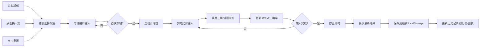

## 1. 产品概述
打字速度测试器是一款面向打字练习者的在线工具，帮助用户测量和提升打字速度与准确率。通过实时反馈、成绩记录和趋势分析，为用户提供直观的打字能力评估。

- 核心价值：提供精准的打字速度和准确率测量，记录历史成绩并可视化进步趋势
- 目标用户：学生、程序员、文案工作者及所有需要提升打字效率的人群

## 2. 核心功能

### 2.1 用户角色
| 角色 | 注册方式 | 核心权限 |
|------|----------|----------|
| 普通用户 | 无需注册，本地存储 | 使用全部打字测试功能、查看历史成绩、管理排行榜 |

### 2.2 功能模块
1. **打字测试主页**：段落展示、输入区域、实时统计、操作按钮
2. **结果展示模块**：完成测试后展示详细成绩数据
3. **历史成绩列表**：展示所有历史测试记录
4. **排行榜模块**：按 WPM 排序的最佳成绩榜单
5. **趋势图表模块**：可视化展示历史成绩变化趋势

### 2.3 页面详情
| 页面名称 | 模块名称 | 功能描述 |
|----------|----------|----------|
| 打字测试主页 | 段落展示区 | 随机展示英文/中文短文，高亮当前字符（绿色正确/红色错误） |
| 打字测试主页 | 输入区域 | 用户输入框，支持拼音输入法，实时比对输入内容 |
| 打字测试主页 | 实时统计栏 | 显示计时器、实时 WPM、正确率、进度 |
| 打字测试主页 | 操作控制区 | 换一篇、暂停/继续、重置按钮 |
| 结果弹窗 | 成绩展示 | 最终 WPM、正确率、用时、日期 |
| 侧边栏 | 历史记录 | 列表展示所有历史测试成绩 |
| 侧边栏 | 排行榜 | 按 WPM 排序的 Top 10 成绩 |
| 侧边栏 | 趋势图表 | 折线图展示最近成绩变化趋势 |

## 3. 核心流程

用户进入页面 → 随机加载一段文字 → 开始输入（自动计时）→ 实时高亮显示正确/错误字符 → 实时更新 WPM 和正确率 → 完成全部输入 → 自动停止计时并展示结果 → 保存成绩到本地存储 → 可查看历史记录和趋势图表

## 4. 用户界面设计

### 4.1 设计风格
- **设计方向**：现代极简主义 + 科技感，深色主题为主
- **主色调**：深靛蓝 `#1e1b4b` 作为背景，翡翠绿 `#10b981` 表示正确，玫瑰红 `#f43f5e` 表示错误
- **辅助色**：琥珀黄 `#f59e0b` 用于高亮当前字符，蓝紫渐变用于强调元素
- **按钮风格**：圆角 12px，轻微阴影，悬停时有缩放和发光效果
- **字体**：使用 `JetBrains Mono` 等宽字体展示打字内容，`Inter` 作为界面字体
- **布局风格**：卡片式布局，主测试区居中，侧边栏可折叠显示历史记录
- **图标**：使用 `lucide-vue-next` 线性图标风格

### 4.2 页面设计概述
| 页面名称 | 模块名称 | UI Elements |
|----------|----------|-------------|
| 打字测试主页 | 段落展示区 | 大字号等宽字体，字符级高亮，当前字符下划线闪烁动画 |
| 打字测试主页 | 统计信息栏 | 玻璃拟态效果卡片，数据指标采用渐变色字体 |
| 打字测试主页 | 输入框 | 无边框设计，底部渐变边框，聚焦时发光效果 |
| 打字测试主页 | 操作按钮 | 图标 + 文字，悬停动效，禁用状态灰显 |
| 结果弹窗 | 成绩卡片 | 渐变背景，大字号展示 WPM，动画数字计数效果 |
| 侧边栏 | 历史记录 | 列表项带日期、WPM、正确率，悬停高亮 |
| 侧边栏 | 排行榜 | 前三名带奖牌图标（金/银/铜） |
| 侧边栏 | 趋势图表 | 平滑曲线折线图，渐变色填充区域 |

### 4.3 响应式
- 桌面端（>1024px）：主测试区 + 右侧边栏布局
- 平板端（768-1024px）：侧边栏改为底部抽屉
- 移动端（<768px）：单列布局，历史记录改为可滑动切换的 Tab
- 触摸优化：按钮最小高度 44px，输入框足够大便于拇指操作

### 4.4 动效设计
- 页面加载：元素渐入动画，错落延迟
- 字符输入：正确字符有轻微缩放反馈，错误字符有抖动效果
- 计时器：数字变化时平滑过渡
- 结果展示：数字从 0 滚动到最终值的计数动画
- 按钮交互：点击时的缩放反馈 `scale(0.95)`
- 侧边栏切换：平滑的滑动过渡动画
