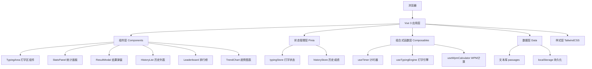
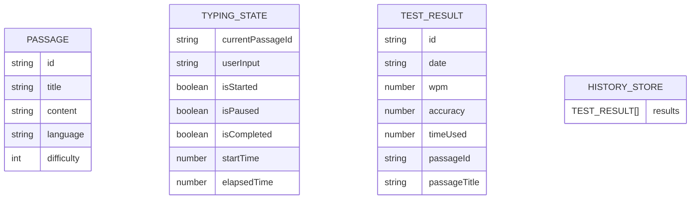

## 1. 架构设计



## 2. 技术描述

- **前端框架**：Vue 3 (Composition API) + TypeScript
- **构建工具**：Vite 5.x
- **状态管理**：Pinia 2.x
- **UI 样式**：TailwindCSS 3.x + SCSS
- **图表库**：Chart.js 4.x + vue-chartjs
- **图标库**：lucide-vue-next
- **数据持久化**：localStorage
- **开发端口**：5909

## 3. 目录结构

```
src/
├── components/
│   ├── TypingArea.vue        # 打字核心区域
│   ├── StatsPanel.vue        # 实时统计面板
│   ├── ControlButtons.vue    # 控制按钮组
│   ├── ResultModal.vue       # 结果展示弹窗
│   ├── HistoryList.vue       # 历史成绩列表
│   ├── Leaderboard.vue       # 排行榜
│   └── TrendChart.vue        # 趋势图表
├── composables/
│   ├── useTimer.ts           # 计时器组合函数
│   ├── useTypingEngine.ts    # 打字引擎逻辑
│   └── useWpmCalculator.ts   # WPM 计算器
├── stores/
│   ├── typing.ts             # 打字状态管理
│   └── history.ts            # 历史成绩管理
├── data/
│   └── passages.ts           # 文本段落数据
├── types/
│   └── index.ts              # 类型定义
├── utils/
│   └── storage.ts            # localStorage 工具函数
├── App.vue
├── main.ts
└── style.css
```

## 4. 路由定义

| 路由 | 用途 |
|------|------|
| / | 打字测试主页（单页应用，无需多路由） |

## 5. 数据模型

### 5.1 数据模型定义



### 5.2 TypeScript 类型定义

```typescript
// 段落类型
interface Passage {
  id: string;
  title: string;
  content: string;
  language: 'en' | 'zh';
  difficulty: 1 | 2 | 3;
}

// 打字状态
interface TypingState {
  currentPassage: Passage | null;
  userInput: string;
  isStarted: boolean;
  isPaused: boolean;
  isCompleted: boolean;
  startTime: number;
  elapsedTime: number;
}

// 测试结果
interface TestResult {
  id: string;
  date: string;
  wpm: number;
  accuracy: number;
  timeUsed: number;
  passageId: string;
  passageTitle: string;
}

// 字符状态
interface CharState {
  char: string;
  status: 'pending' | 'correct' | 'incorrect' | 'current';
}
```

## 6. 核心算法

### 6.1 WPM 计算
```
WPM = (正确字符数 / 5) / (用时分钟数)
实时更新：每次输入变化后重新计算
```

### 6.2 正确率计算
```
正确率 = 正确字符数 / 总已输入字符数 * 100%
```

### 6.3 字符高亮逻辑
- 遍历目标文本的每个字符
- 与用户输入对应位置比较
- 当前字符：黄色下划线闪烁
- 已输入正确：绿色
- 已输入错误：红色
- 未输入：灰色

### 6.4 计时器实现
- 使用 `performance.now()` 获取高精度时间
- 首次输入时记录 `startTime`
- 暂停时记录暂停时间段
- 恢复时调整 `startTime`
- 使用 `requestAnimationFrame` 实现流畅更新

## 7. 状态管理（Pinia）

### typing store
- `currentPassage`: 当前段落
- `userInput`: 用户输入
- `isStarted/isPaused/isCompleted`: 状态标志
- `startTime/elapsedTime`: 时间数据
- Actions: `selectPassage()`, `startTyping()`, `pauseTyping()`, `resetTyping()`, `completeTyping()`

### history store
- `results`: 历史成绩数组
- Actions: `addResult()`, `clearHistory()`, `getLeaderboard()`
- Persist: 自动同步到 localStorage

## 8. 性能优化

1. **虚拟滚动**：历史记录列表使用虚拟滚动（数据量大时）
2. **防抖优化**：WPM 计算使用 requestAnimationFrame 节流
3. **记忆化计算**：字符状态使用 computed 缓存
4. **组件拆分**：大组件拆分为小组件，减少重渲染范围
5. **LocalStorage 读写**：使用节流，避免频繁写入
